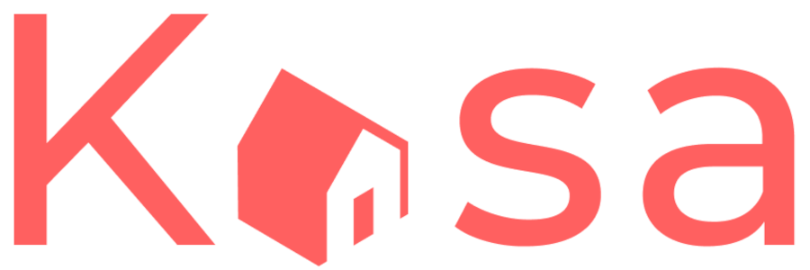

# Kasa
> Projet 11 - Développez une application Web avec React et React Router
## Author 

- Tangi LE CADRE
## Technologies

- 
- 
- 
- 
- 

## Resources provided

## Installation

### Prerequisites

- 
- 
- 

### Installing and launching Kasa

Clone the repository of Kasa Front-End:

- 

Inside this repository, install dependencies:

`npm install`

Launch on port 3000:

`npm start`

Front-End is now rendered at URL `http://localhost:3000`